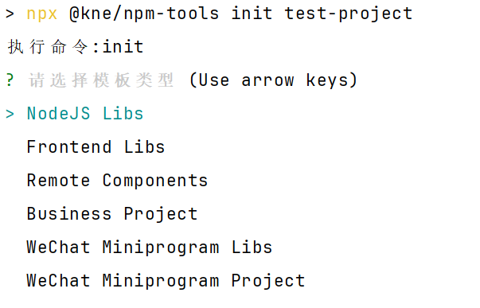

> 初始化项目

我们提供了脚手架程序来初始化一个项目，并默认提供了一些常用的项目模板：

执行以下脚本使用脚手架初始化一个项目

```shell
npx @kne/npm-tools init [project-name]
```



选择模板类型

* NodeJs Libs 不需要前端构建可以直接使用，主要在node端使用，不需要提供在线example演示，有部分可以在客户端环境使用需额外注明
* Frontend Libs 前端库，需要使用microbundle进行构建，需要提供在线example演示
* Remote Components 远程组件库，可以通过remote-loader在Business Project中加载，通过modules-dev进行构建，需要提供example演示
* Business Project 业务项目，可以使用Remote Components，也可以给其他的Business Project提供业务组件，通过modules-dev进行构建
* WeChat Miniprogram Libs 小程序组件库，主要给用在Taro构建的小程序提供组件，由mini-example提供一个组件演示环境，需要提供example演示
* WeChat Miniprogram Project 小程序业务项目，由Taro构建，可以使用WeChat Miniprogram Libs提供的组件

完成初始化后执行

```shell
cd [project-name]
npm run start
```

> 发布与构建

如果你的项目是在kne-union组织中，在你按照***github代码提交规范***
提交代码的时候会自动触发对应的github actions进行构建与发布流程。

如果你的项目是私有的，不便于发布在公开的github上，你可以参照[kne-union的自动化发布脚本](https://github.com/kne-union/actions)
来构建你自己的CI/CD流水线。

> Remote Components 的私有化部署

一般而言，我们推荐使用我们构建好的Remote Components源。我们会自动将所有kne-union的远程组件作为npm
package发布到npm上，你可以使用一些npm的cdn来进行访问，例如：

1. [https://registry.npmmirror.com/](https://registry.npmmirror.com/) 阿里npm源
2. [https://www.unpkg.com/](https://www.unpkg.com/) unpkg
3. [https://www.jsdelivr.com/](https://www.jsdelivr.com/) jsdelivr

你只需按照对应的url规则获取到remoteEntry.js文件所在目录在src/preset.js中进行配置就可以直接使用

npmmirror

```js
const remoteConfig = {
    '[name]': {
        'remote': '[name]',
        'url': 'https://registry.npmmirror.com',
        'tpl': '{{url}}/@kne-components%2f{{remote}}/{{version}}/files/build',
        'defaultVersion': '[version]'
    }
}
```

unpkg

```js
const remoteConfig = {
    '[name]': {
        'remote': '[name]',
        'url': 'https://unpkg.com',
        'tpl': '{{url}}/@kne-components/{{remote}}@{{version}}/build',
        'defaultVersion': '[version]'
    }
}
```

jsdelivr

```js
const remoteConfig = {
    '[name]': {
        'remote': '[name]',
        'url': 'https://cdn.jsdelivr.net',
        'tpl': '{{url}}/npm/@kne-components/{{remote}}@{{version}}/build',
        'defaultVersion': '[version]'
    }
}
```

脚手架默认会使用npmmirror配置
