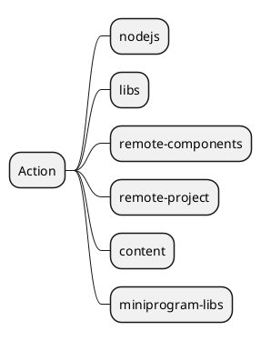
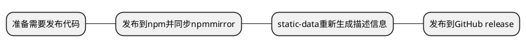
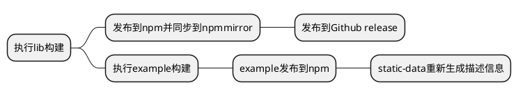
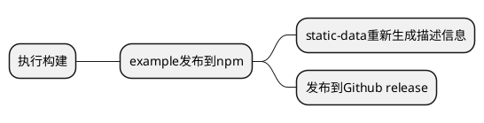
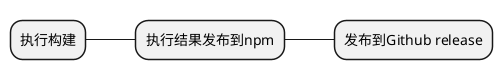
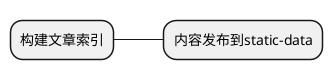
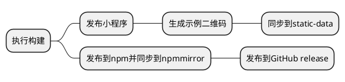

在KneUnion中托管的项目目前可以分为3种：

1. npm package，它需要在提交新的修改时向npm发布新的版本，并且为了npmmirror源可以立即使用，需要执行当前包的同步操作。
2. remote components，它需要执行build构建之后将结果发布到GitHub pages，还需要发布到npm以同步到cdn。
3. 日志类型内容，需要在提交修改后生成索引文件，然后发布到Github pages。

之前，我通过github actions完成了上述操作，但是存在以下的问题：

* 之前的actions脚本是放在自己项目中的，actions如果想要升级，需要每个项目改一遍。
* 为了ued项目能访问到每个项目的构建结果，每个项目都得搞一个Github pages，当需要把ued项目部署到其他服务器或者cdn，需要从各个项目拉gh-pages代码进行部署，而且很难只管地看见ued项目需求哪些项目的构建后代码。

接下来我开始构思改造工作，首先，我想先创建一个项目，专门用来放置其他项目产生的数据，可以由其他项目的action向该项目推送执行结果，其他除ued之外的项目不需要自己配置gh-pages。然后通过GitHub action的reused workflow和自定义action来完成所有类型的构建工作。

首先，将现有项目重新分为以下类型:

然后设计出没从类型的构建过程：

nodejs: 不需要构建的npm package

libs：需要构建的npm package，示例需要自动发布到ued

remote-components: 远程组件项目，需要构建，示例自动发布到ued

remote-project：ued为一个典型的remote-project项目

content: 管理内容的项目，比如blog项目

miniprogram-libs：小程序组件库，需要构建并且示例自动发布到ued

设计完所有的构建过程之后，将公共部分分别实现，然后将所有workflow发布到[actions项目](https://github.com/kne-union/actions)中

然后实现不同类型的脚手架模板，让其中的actions workflow引用 actions项目中对应项目的workflow实现

当对应类型的actions需要更新时，只需要集中在actions项目维护就可以做到整个系统的所有项目的同步升级

