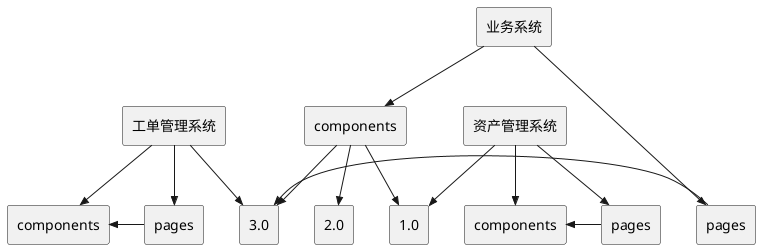
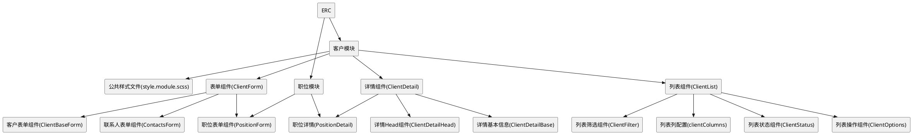

> 项目优化的重要性

我们在做业务的时候，由于迭代时间有限往往以完成业务功能为第一优先级，很难有很多时间去进行适当的设计导致项目中存在大量的：

* 组件API设计有缺陷，不易进行扩展，考虑到的使用场景有限

* 代码随手写，没有进行适当的归类整理，调用关系复杂混乱，难以理解。一个文件中充斥好几百行代码，这些代码作用复杂，相互耦合，不能复用，且牵一发而动全身，在后续修改逻辑的时候非常容易误伤不需要修改的逻辑

* 代码重复率高，通常是把一个实现近似功能的代码块整个复制到新的位置修改过部分逻辑完成业务功能后就不管了

* 盲目的把很多功能奇怪的代码放在类似common的文件或者文件夹里面，导致长时间以后common文件或者文件夹代码急剧膨胀导致不可维护

* 欠缺项目级结构设计，没有分层设计，不同模块随意相互调用，不能形成自底而上的树状组织结构，而是形成了网状结构

而一个被良好设计的项目可以在面临需求变更的时候，最大化降低之前业务逻辑的理解成本。在修改功能的时候，精准控制，只对需要变更的地方进行修改，并且能准确评估修改的影响范围，不产生意外的影响。在新的业务开发中能通过老的业务中的积累，有效的形成滚雪球的趋势，项目越庞大，可以复用的东西就越多越完善，实现新的功能模块就越容易，耗费越少的时间，而不是相反。

> 项目优化的一些要点

一个核心的原则就是，要把混乱的东西变得清晰有条理。和盖一间房子类似，首先我们需要进行一些顶层设计，明确项目的构成部分，构成部分该如何配合。例如我们的项目就拥有以下的结构



一个项目基本由pages和components构成，pages是最终展示到浏览器的页面，components是组成pages的组件。

虽然看起来很简单，但是在实际过程中却出现了一些偏差：

* pages的目录系统设计应该对应到路由，和路由是一一对应关系，不应该把无关文件或者组件放在pages里面

* pages之间不应该存在调用关系

* pages的作用只是最终按照业务需求对组件进行组合，不应该在里面完成业务逻辑，即pages应该足够简单，它只描述组件的组合关系

* components之间可以相互调用和组合，可以由简单的components通过一定的结构设计组成复杂的组件

* components不应该依赖属于项目本身的东西，比如项目配置，项目的后端api等部分，我们设计了preset机制，components应该通过preset机制和props传递去获取这些部分

* 业务系统的components包含View,Form,List结尾的组件，分别为详情展示组件，表单组件和列表组件

* 一个components中的组件应该有其自身的结构，通常我们通过视觉部分划分和功能部分划分。视觉部分通过视觉设计可以将其分割为不同的部分分别实现后通过一个组件进行组合。分割的组件通常在视觉和交互和功能上相对独立。然后进行功能划分，一般分为容器组件，展示组件，逻辑方法。首先将业务逻辑抽象成功能明确的纯函数，**纯函数是指，其功能单一，所有数据来源于向其传入的参数，它本身不从上下文或者外部环境中获取任何参数或者变量，它可以调用其他的纯函数，它在执行完成后向调用的地方返回结果，除了这个结果，它不会影响任何其他的东西**。如果组件的state关系简单可以不用单独提出，如果关系复杂，可以划分为不同的功能用hooks抽象，每个hooks也需要满足单一职责原则。我们把提供state及操作state变化的组件称为容器组件，它是组件的功能核心，把展示数据的部分成为展示组件，展示组件中不应该有逻辑，只是从props中获取对应的数据展示成UI和从props中获取方法用来响应UI事件，通过容器组件，展示组件，逻辑方法三部分的划分，可以让组件功能实现清晰，还可以将展示组件和逻辑方法更大程度上公用给其他组件调用。总之，我们的两个大的原则是：
  
  * 一个方法，一个hooks，一个组件其功能必须是单一的
  
  * 组件的业务逻辑和展示逻辑分离

* components的派生问题，如果一个组件A里面包含了组件B，并且组件B能完全满足其功能要求，我们可以直接引用组件B进行组合，但是如果A里面包含了B的一部分，B的另一部分不能满足组件A的功能要求，那么一种通常的做法是，给B设置一个参数，在B里面进行判断，如果传入B的参数为1展示C，执行C逻辑，传入的参数为2展示D，执行D逻辑。但是这种方法会极大的增加组件B的复杂性。遇到这种情况，我们应该首先对B进行功能的再拆分即：B=M+C;M为可以公用的部分，然后我们实现功能D，然后派生出组件B1=M+D;这样我们需要B的地方调用B，需要B1的地方就调用B1，减少了通过参数判断的逻辑过程。

* 不当的抽象导致代码的可读性下降

```jsx
const holdingEnums = {
  stateEnum: Promise.resolve({
    1: {
      label: '待提交预提',
      type: 'info',
      userActions: [
        { label: '编辑', id: 'edit', key: record => (record.projectTypeId !== 9 ? 'projectEdit' : 'edit') },
        {
          label: '提交预提',
          id: 'submit',
          key: 'submit',
          type: 'confirm',
          title: '确定提交预提吗?',
          message: '点击确定后,该预提申请将提交给审核人'
        }
      ],
      manageActions: []
    },
    2: {
      label: '审核中',
      type: 'progress',
      userActions: [{ label: '撤销预提', id: 'cancel', key: 'cancel' }],
      manageActions: [{ label: '去审批', id: 'aduit', key: 'aduit', to: '/flow/detail/${id}' }]
    },
    3: {
      label: '预提通过',
      type: 'success',
      userActions: [
        {
          label: '复制',
          tourkey: 'holdingCopy',
          id: 'copy',
          key: record => (record.projectTypeId !== 9 ? 'projectCopy' : 'copy'),
          display: record => {
            return record.hasCopyAuth && record?.canCopyProvision && record.provisionType === 1;
          }
        },
        {
          label: '红冲',
          tourkey: 'holdingRedDash',
          id: 'redDash',
          key: record => (record.projectTypeId !== 9 ? 'projectRedDash' : 'redDash'),
          display: record => {
            return record?.canRedDash && record.provisionType === 1;
          }
        }
      ]
    },
    4: {
      label: '预提拒绝',
      type: 'danger',
      userActions: [
        { label: '编辑', id: 'edit', key: record => (record.projectTypeId !== 9 ? 'projectEdit' : 'edit') },
        {
          label: '提交预提',
          id: 'submit',
          key: 'submit',
          type: 'confirm',
          title: '确定提交预提吗?',
          message: '点击确定后,该预提申请将提交给审核人'
        }
      ],
      manageActions: []
    },
    5: {
      label: '撤销预提',
      type: 'default',
      userActions: [
        { label: '编辑', id: 'edit', key: record => (record.projectTypeId !== 9 ? 'projectEdit' : 'edit') },
        {
          label: '提交预提',
          id: 'submit',
          key: 'submit',
          type: 'confirm',
          title: '确定提交预提吗?',
          message: '点击确定后,该预提申请将提交给审核人'
        }
      ],
      manageActions: []
    }
  })
};


const StateContent = createWithFetch({ loader: () => holdingEnums.stateEnum })(({ data, state, remoteModules }) => {
  const [StateTag] = remoteModules;
  const type = get(data[state], 'type') || 'info';
  const label = get(data[state], 'label') || '-';
  return <StateTag type={type} text={label} />;
});
```

上面这段代码，将预提的操作对应成一个数字，在调用的地方我们不得不面对可读性极差的数字判断，在对应的业务里面也不能直观的反应出数字对应的是什么操作。正确的方法应该是将这些东西做成组件，负责提示的组件就负责提示，负责展示标签的就展示标签，在业务里面进行声明式调用，如果需要和后端的权限或者状态code做对应，可以再封装一个逻辑组件去做这个事情，来调用这里的提示组件和标签组件。另外作为一个配置文件，提供数据就只提供数据，不要把数据和处理逻辑都糅合在一个地方。

以下是一个相对比较健康的设计



通过不同模块的拆分和组合优于一个大组件完成所有功能


> 何时进行优化工作

通常我们不会专门留出优化项目或者代码的时间。所以我们在接到一个需求的时候需要先花一点时间进行简单的设计和规划，如果有条件我们可以用简单的脚手架命令来生成一个模块的基本的组件页面结构。

我们可能在编写代码的时候为了方便，写了一个很大的组件，然后完成了功能。在代码提交完以后，你需要用几分钟思考一下，组件可不可以分成有功能意义的几部分，按照我们的容器组件，展示组件，逻辑方法原则可以把每一部分再分成独立的及部分，当然再组件刚开始创建规模不大的时候，你可以把几部分放在同一个文件里面，不必要非要切分成几个文件，但是需要确保它们之中的每一部分都是独立的以便在组件的发展过程中代码膨胀，可以方便的把它切分到不同的文件之中。

在完成了需求开发，修改bug时，你需要花一些时间进行优化，修正组件划分不合理，组件State设置不合理等情况。

在某个模块需求发生变更的时候，你需要看看之前该模块的代码是否合理，如果你花了很长时间才能回忆起当时的业务逻辑，那么你就需要对该模块进行优化。一个模块好的代码实现，所有逻辑应该是一目了然的。
