# 为什么要建立这个系统

我们在工作协作中需要和其他人沟通，记录一些自己的想法，将工作中一些重要的事情格式化为标准的文档。

我需要一个随时方便查看，可以支持多人协作编辑，表现力强的博客系统。这个系统必须使用简单，符合大家的使用习惯，已于和我们已有的技术框架结合。

我使用了markdown语法来构建这个系统，并且在开源社区找到了不错的工具支持强大的表现力。通过git来管理整个文档，非常高效且简单。希望我和我的团队能从我的工作中受益。

# 基本使用流程

* 如果你不熟悉markdown语法，你可以使用marktext编辑器来编辑你的文档，下载地址:[marktext](https://www.marktext.cc/)

# 一些使用示例

### 基本的markdown语法

> 标题

```md
# 这是一级标题
## 这是二级标题
### 这是三级标题
#### 这是四级标题
##### 这是五级标题
###### 这是六级标题
```

# 这是一级标题

## 这是二级标题

### 这是三级标题

#### 这是四级标题

##### 这是五级标题

###### 这是六级标题

> 字体

```md
**这是加粗的文字**
*这是倾斜的文字*`
***这是斜体加粗的文字***
~~这是加删除线的文字~~
```

**这是加粗的文字** *这是倾斜的文字*` ***这是斜体加粗的文字*** ~~这是加删除线的文字~~

> 分割线

```md
---
----
***
*****
```

---

---

***

******

> 图片

**注意：需要先放置在assets文件夹中才能引用**

```md

```


也支持带有图片大小和对齐方式的图片写法

```md

```


> 超链接

```
[点击我跳转到百度](https://www.baidu.com)
```

[点击我跳转到百度](https://www.baidu.com)

> 列表

```md
* 列表内容
* 列表内容
* 列表内容
```

- 列表内容
- 列表内容
- 列表内容

> 带有数字的列表

```md
1. 列表内容
2. 列表内容
3. 列表内容
```

1. 列表内容
2. 列表内容
3. 列表

> 引用块

```md
>这是引用的内容
>>这是引用的内容
>>>>>>>>>>这是引用的内容
```

> 这是引用的内容
> 
> > 这是引用的内容
> > 
> > > > > > > > > > 这是引用的

> 表格

```md
| 表头  | 表头  | 表头  |
| --- | --- | --- |
| 内容  | 内容  | 内容  |
| 内容  | 内容  | 内容  |
```

| 表头  | 表头  | 表头  |
| --- | --- | --- |
| 内容  | 内容  | 内容  |
| 内容  | 内容  | 内容  |

### 高级功能

<div style="font-size:18px;font-weight:bold;background:var(--primary-color);color:#FFF;padding: 4px 8px;border-radius: 2px;">TODO List</div>

TODO List 是扩展markdown的语法

```md
- [x] 这是选中效果
- [x] 这是选中效果
- [x] 这是选中效果
- [ ] 这是未选中效果
- [ ] 这是未选中效果
- [ ] 这是未选中效果
```

- [x] 这是选中效果
- [x] 这是选中效果
- [x] 这是选中效果
- [ ] 这是未选中效果
- [ ] 这是未选中效果
- [ ] 这是未选中效果

<div style="font-size:18px;font-weight:bold;background:var(--primary-color);color:#FFF;padding: 4px 8px;border-radius: 2px;">HTML支持</div>

我们的文档支持html，你可以直接在文档里写html，可以被正确解析

```html
<div style="padding: 20px;background: cornflowerblue;color:#FFF;margin: 20px;border-radius: 10px;text-align: center">示例</div>
```

<div style="padding: 20px;background: cornflowerblue;color:#FFF;margin: 20px;border-radius: 10px;text-align: center">示例</div>

<div style="font-size:18px;font-weight:bold;background:var(--primary-color);color:#FFF;padding: 4px 8px;border-radius: 2px;">mermaid</div>

Mermaid 是一种基于 JavaScript 的图表绘制工具，它使用受 Markdown 启发的文本定义和渲染器来创建和修改复杂的图表。Mermaid 的主要目的是帮助文档跟上开发的步伐。


> 流程图

```md
flowchart LR
    A[Hard] -->|Text| B(Round)
    B --> C{Decision}
    C -->|One| D[Result 1]
    C -->|Two| E[Result 2]
```

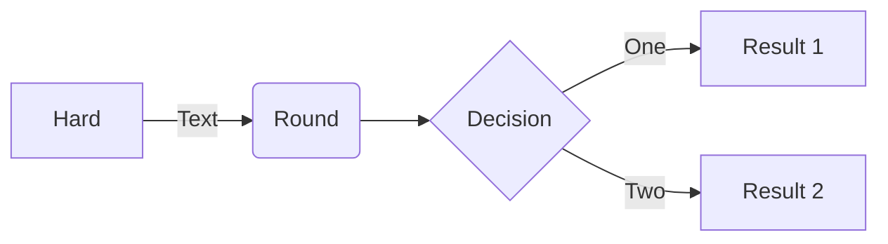

> 竖向流程图

```md
flowchart TD
    A[Start] --> B{Is it?}
    B -- Yes --> C[OK]
    C --> D[Rethink]
    D --> B
    B -- No ----> E[End]
```

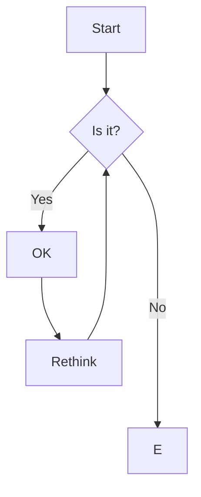

> 时序图

```
sequenceDiagram
    Alice->>John: Hello John, how are you?
    John-->>Alice: Great!
    Alice-)John: See you later!
```

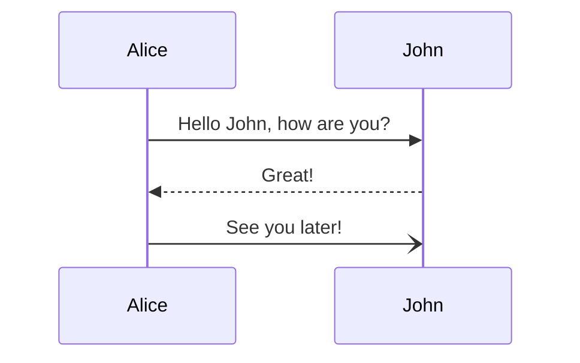

> 类图

```md
---
title: Animal example
---
classDiagram
    note "From Duck till Zebra"
    Animal <|-- Duck
    note for Duck "can fly\ncan swim\ncan dive\ncan help in debugging"
    Animal <|-- Fish
    Animal <|-- Zebra
    Animal : +int age
    Animal : +String gender
    Animal: +isMammal()
    Animal: +mate()
    class Duck{
        +String beakColor
        +swim()
        +quack()
    }
    class Fish{
        -int sizeInFeet
        -canEat()
    }
    class Zebra{
        +bool is_wild
        +run()
    }
```

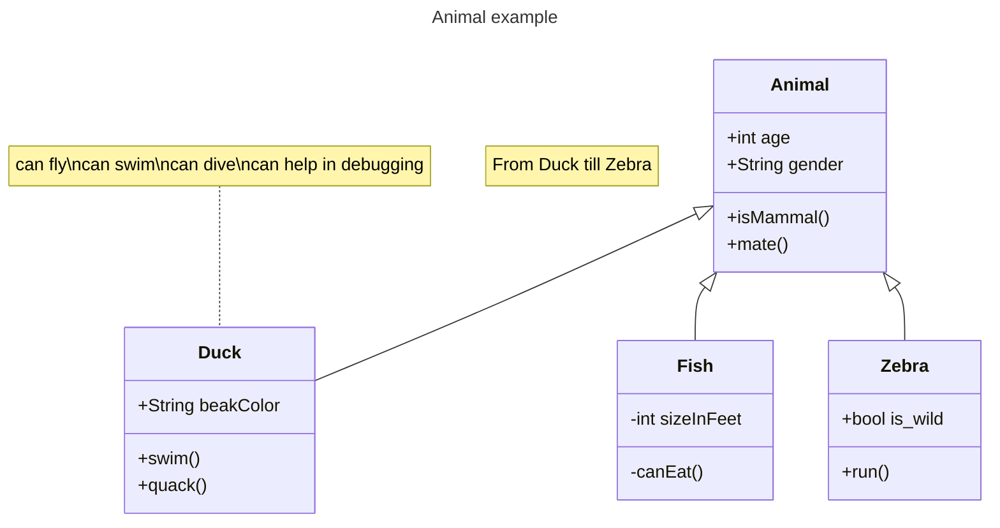

> 状态图

```md
---
title: Simple sample
---
stateDiagram-v2
    [*] --> Still
    Still --> [*]

    Still --> Moving
    Moving --> Still
    Moving --> Crash
    Crash --> [*]
```

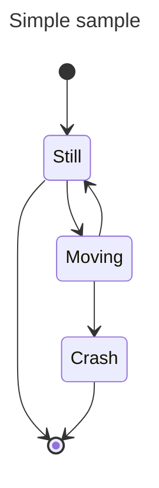

> 甘特图

```md
gantt
    title A Gantt Diagram
    dateFormat  YYYY-MM-DD
    section Section
    A task           :a1, 2014-01-01, 30d
    Another task     :after a1  , 20d
    section Another
    Task in sec      :2014-01-12  , 12d
    another task      : 24d
```

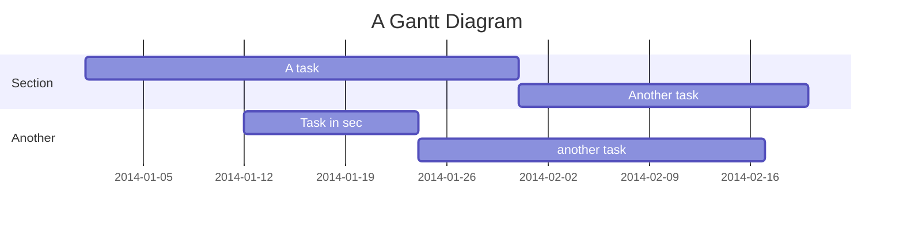

> 饼图

```md
pie title Pets adopted by volunteers
    "Dogs" : 386
    "Cats" : 85
    "Rats" : 15
```

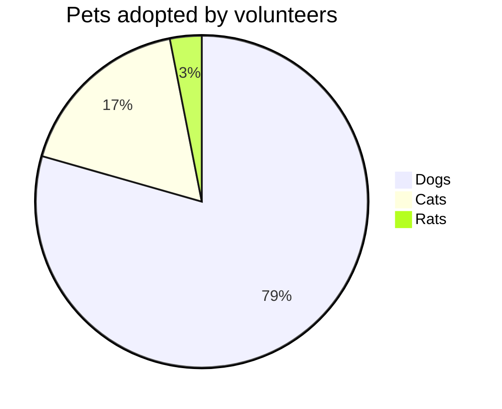

> Timeline

```md
timeline
    title History of Social Media Platform
    2002 : LinkedIn
    2004 : Facebook
         : Google
    2005 : Youtube
    2006 : Twitter
```

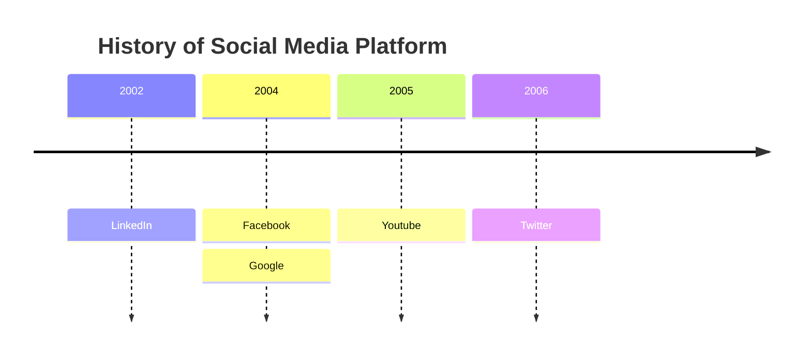

> 思维导图

```md
mindmap
  root((mindmap))
    Origins
      Long history
      ::icon(fa fa-book)
      Popularisation
        British popular psychology author Tony Buzan
    Research
      On effectiveness<br/>and features
      On Automatic creation
        Uses
            Creative techniques
            Strategic planning
            Argument mapping
    Tools
      Pen and paper
      Mermaid
```

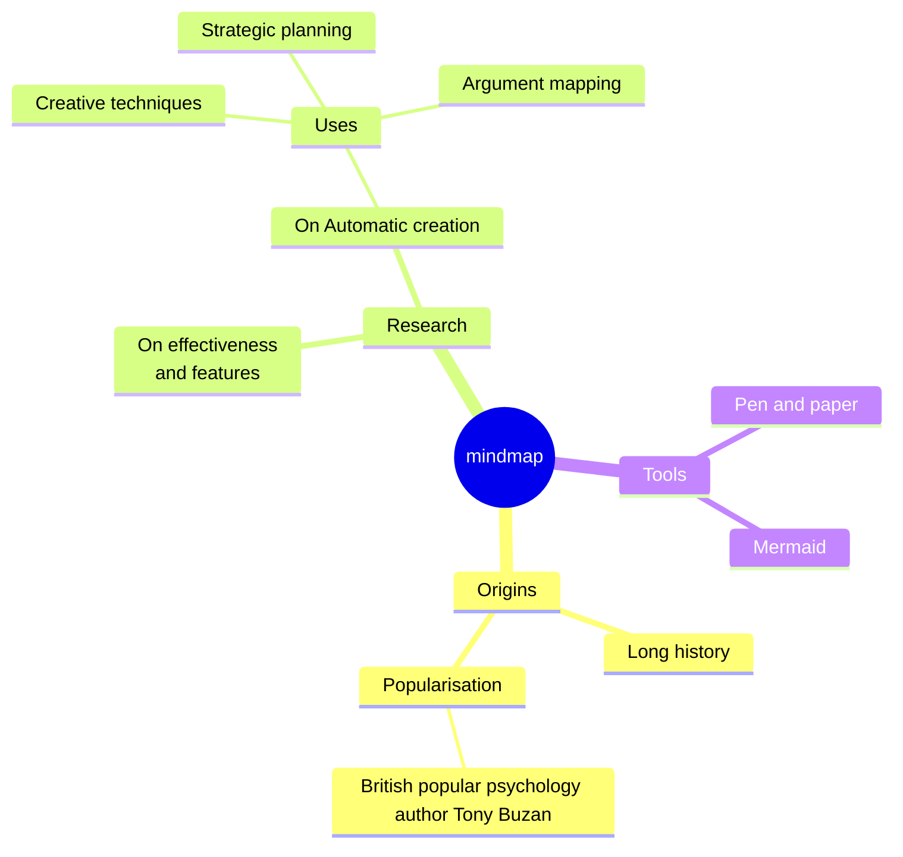

更多用法请参考[mermaid官网](https://mermaid.js.org/)

<div style="font-size:18px;font-weight:bold;background:var(--primary-color);color:#FFF;padding: 4px 8px;border-radius: 2px;">plantuml</div>

**PlantUML**是一个允许你快速编写的组件：

- [序列图](https://plantuml.com/zh/sequence-diagram)
- [用例图](https://plantuml.com/zh/use-case-diagram)
- [类图](https://plantuml.com/zh/class-diagram)
- [对象图](https://plantuml.com/zh/object-diagram)
- [活动图](https://plantuml.com/zh/activity-diagram-beta)（这里是[传统的语法](https://plantuml.com/zh/activity-diagram-legacy)）。
- [组件图](https://plantuml.com/zh/component-diagram)
- [部署图](https://plantuml.com/zh/deployment-diagram)
- [状态图](https://plantuml.com/zh/state-diagram)
- [时序图](https://plantuml.com/zh/timing-diagram)

也支持以下非UML图表：

- [JSON数据](https://plantuml.com/zh/json)
- [YAML数据](https://plantuml.com/zh/yaml)
- [Extended Backus-Naur Form (EBNF)图表](https://plantuml.com/zh/ebnf)
- [网络图（nwdiag）](https://plantuml.com/zh/nwdiag)
- [线框图形界面或UI模拟图（盐）。](https://plantuml.com/zh/salt)
- [架构图](https://plantuml.com/zh/archimate-diagram)
- [规范和描述语言（SDL）](https://plantuml.com/zh/activity-diagram-beta#sdl)
- [Ditaa图](https://plantuml.com/zh/ditaa)
- [甘特图](https://plantuml.com/zh/gantt-diagram)
- [思维导图](https://plantuml.com/zh/mindmap-diagram)
- [工作分解结构图（WBS）](https://plantuml.com/zh/wbs-diagram)
- [用AsciiMath或JLaTeXMath符号进行数学计算](https://plantuml.com/zh/ascii-math)
- [实体关系图（IE/ER）。](https://plantuml.com/zh/ie-diagram)

此外：

- [超链接和工具提示](https://plantuml.com/zh/link)
- [克里奥尔语](https://plantuml.com/zh/creole)：富文本、表情符号、unicode、图标
- [OpenIconic图标](https://plantuml.com/zh/openiconic)
- [Sprite图标](https://plantuml.com/zh/sprite)
- [AsciiMath数学表达式](https://plantuml.com/zh/ascii-math)

图形是用一种简单直观的语言定义的。

> 序列图

```md
@startuml
participant Alice
participant "The **Famous** Bob" as Bob

Alice -> Bob : hello --there--
... Some ~~long delay~~ ...
Bob -> Alice : ok
note left
  This is **bold**
  This is //italics//
  This is ""monospaced""
  This is --stroked--
  This is __underlined__
  This is ~~waved~~
end note

Alice -> Bob : A //well formatted// message
note right of Alice
 This is <back:cadetblue><size:18>displayed</size></back>
 __left of__ Alice.
end note
note left of Bob
 <u:red>This</u> is <color #118888>displayed</color>
 **<color purple>left of</color> <s:red>Alice</strike> Bob**.
end note
note over Alice, Bob
 <w:#FF33FF>This is hosted</w> by 
end note
@enduml
```

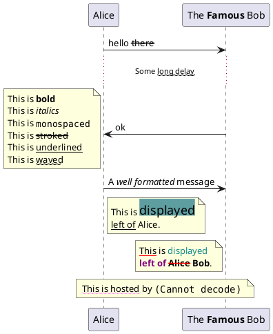

> 用例图

```md
@startuml
:Main Admin: as Admin
(Use the application) as (Use)

User -> (Start)
User --> (Use)

Admin ---> (Use)

note right of Admin : This is an example.

note right of (Use)
  A note can also
  be on several lines
end note

note "This note is connected\nto several objects." as N2
(Start) .. N2
N2 .. (Use)
@enduml
```

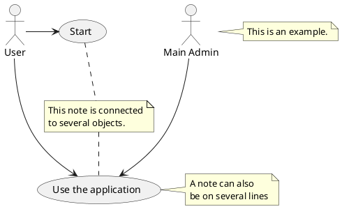

> 类图

```md
@startuml
class A {
{static} int counter
+void {abstract} start(int timeout)
}
note left of A::counter
  该成员已注释
end note
note right of A::start
  在 UML 注释了此方法
end note
@enduml
```

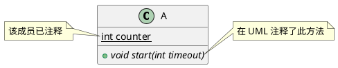

> 对象图

```md
@startuml
object London
object Washington
object Berlin
object NewYork

map CapitalCity {
 UK *-> London
 USA *--> Washington
 Germany *---> Berlin
}

NewYork --> CapitalCity::USA
@enduml
```

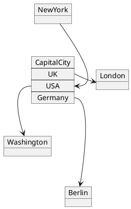

> 流程图

```md
@startuml
start
repeat
  :测试某事;
    if (发生错误?) then (没有)
      #palegreen:好的;
      break
    endif
    ->not ok;
    :弹窗 "文本过长错误";
repeat while (某事发生文本过长错误?) is (是的) not (不是)
->//合并步骤//;
:弹窗 "成功！";
stop
@enduml
```

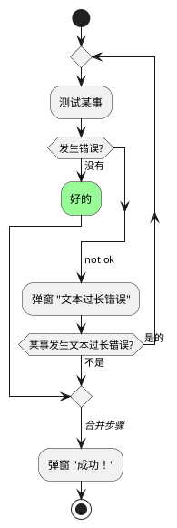

> 组件图

```md
@startuml
package "Some Group" {
  HTTP - [First Component]
  [Another Component]
}

node "Other Groups" {
  FTP - [Second Component]
  [First Component] --> FTP
}

cloud {
  [Example 1]
}


database "MySql" {
  folder "This is my folder" {
    [Folder 3]
  }
  frame "Foo" {
    [Frame 4]
  }
}


[Another Component] --> [Example 1]
[Example 1] --> [Folder 3]
[Folder 3] --> [Frame 4]
@enduml
```

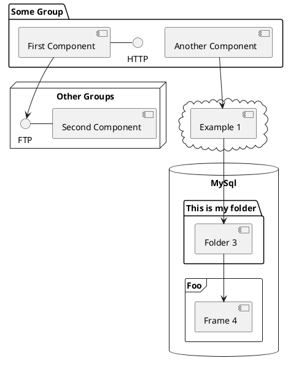

> 时序图

```md
@startuml
clock   "Clock_0"   as C0 with period 50
clock   "Clock_1"   as C1 with period 50 pulse 15 offset 10
binary  "Binary"  as B
concise "Concise" as C
robust  "Robust"  as R
analog  "Analog"  as A


@0
C is Idle
R is Idle
A is 0

@100
B is high
C is Waiting
R is Processing
A is 3

@300
R is Waiting
A is 1
@enduml
```

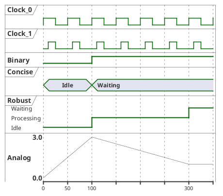

> 状态图

```md
@startuml
scale 350 width
[*] --> NotShooting

state NotShooting {
  [*] --> Idle
  Idle --> Configuring : EvConfig
  Configuring --> Idle : EvConfig
}

state Configuring {
  [*] --> NewValueSelection
  NewValueSelection --> NewValuePreview : EvNewValue
  NewValuePreview --> NewValueSelection : EvNewValueRejected
  NewValuePreview --> NewValueSelection : EvNewValueSaved

  state NewValuePreview {
     State1 -> State2
  }

}
@enduml
```

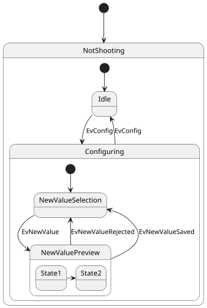

> JSON展示

```md
@startjson
{
  "firstName": "John",
  "lastName": "Smith",
  "isAlive": true,
  "age": 27,
  "address": {
    "streetAddress": "21 2nd Street",
    "city": "New York",
    "state": "NY",
    "postalCode": "10021-3100"
  },
  "phoneNumbers": [
    {
      "type": "home",
      "number": "212 555-1234"
    },
    {
      "type": "office",
      "number": "646 555-4567"
    }
  ],
  "children": [],
  "spouse": null
}
@endjson
```

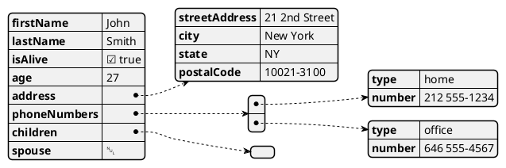

> YML展示

```md
@startyaml
doe: "a deer, a female deer"
ray: "a drop of golden sun"
pi: 3.14159
xmas: true
french-hens: 3
calling-birds: 
    - huey
    - dewey
    - louie
    - fred
xmas-fifth-day: 
    calling-birds: four
    french-hens: 3
    golden-rings: 5
    partridges: 
        count: 1
        location: "a pear tree"
    turtle-doves: two
@endyaml
```

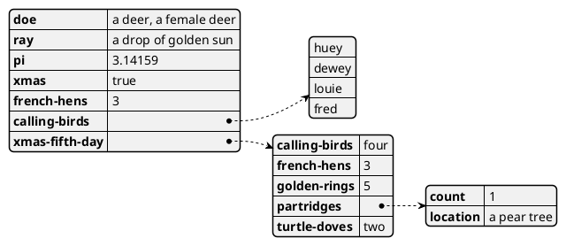

> 思维导图

```md
@startmindmap
* Debian
** Ubuntu
*** Linux Mint
*** Kubuntu
*** Lubuntu
*** KDE Neon
** LMDE
** SolydXK
** SteamOS
** Raspbian with a very long name
*** <s>Raspmbc</s> => OSMC
*** <s>Raspyfi</s> => Volumio
@endmindmap
```

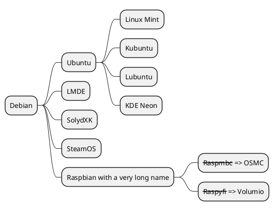

> 甘特图

```md
@startgantt
printscale weekly
saturday are closed
sunday are closed

Project starts the 1st of january 2021
[Prototype design end] as [TASK1] lasts 19 days
[TASK1] is colored in Lavender/LightBlue
[Testing] lasts 14 days
[TASK1]->[Testing]

2021-01-18 to 2021-01-22 are named [End's committee]
2021-01-18 to 2021-01-22 are colored in salmon 
@endgantt
```

```plantuml
@startgantt
printscale weekly
saturday are closed
sunday are closed

Project starts the 1st of january 2021
[Prototype design end] as [TASK1] lasts 19 days
[TASK1] is colored in Lavender/LightBlue
[Testing] lasts 14 days
[TASK1]->[Testing]

2021-01-18 to 2021-01-22 are named [End's committee]
2021-01-18 to 2021-01-22 are colored in salmon 
@endgantt
```

> EBNF

```md
@startebnf
title All EBNF elements managed by PlantUML

(* Nodes *)
litteral = "a";
special = ? a ?;
rule = a;

(* Edges *)
required = a;
optional = [a];

zero_or_more = {a};
one_or_more = a, {a};
one_or_more_ebnf = {a}-;

zero_or_more_with_separator = [a, {',', a}];
one_or_more_with_separator = a, {',', a};
zero_or_more_with_terminator = {a, ','};
one_or_more_with_terminator = a, ',', {a, ','};
one_or_more_with_terminator_ebnf = {a, ','}-;

alternative = a | b;
group = (a | b) , c;
without_group = a | b , c;
@endebnf
```

```plantuml
@startebnf
title All EBNF elements managed by PlantUML

(* Nodes *)
litteral = "a";
special = ? a ?;
rule = a;

(* Edges *)
required = a;
optional = [a];

zero_or_more = {a};
one_or_more = a, {a};
one_or_more_ebnf = {a}-;

zero_or_more_with_separator = [a, {',', a}];
one_or_more_with_separator = a, {',', a};
zero_or_more_with_terminator = {a, ','};
one_or_more_with_terminator = a, ',', {a, ','};
one_or_more_with_terminator_ebnf = {a, ','}-;

alternative = a | b;
group = (a | b) , c;
without_group = a | b , c;
@endebnf
```

> 架构图

```md
@startuml
skinparam rectangle<<behavior>> {
    roundCorner 25
}
sprite $bProcess jar:archimate/business-process
sprite $aService jar:archimate/application-service
sprite $aComponent jar:archimate/application-component

rectangle "Handle claim"  as HC <<$bProcess>><<behavior>> #Business
rectangle "Capture Information"  as CI <<$bProcess>><<behavior>> #Business
rectangle "Notify\nAdditional Stakeholders" as NAS <<$bProcess>><<behavior>> #Business
rectangle "Validate" as V <<$bProcess>><<behavior>> #Business
rectangle "Investigate" as I <<$bProcess>><<behavior>> #Business
rectangle "Pay" as P <<$bProcess>><<behavior>> #Business

HC *-down- CI
HC *-down- NAS
HC *-down- V
HC *-down- I
HC *-down- P

CI -right->> NAS
NAS -right->> V
V -right->> I
I -right->> P

rectangle "Scanning" as scanning <<$aService>><<behavior>> #Application
rectangle "Customer admnistration" as customerAdministration <<$aService>><<behavior>> #Application
rectangle "Claims admnistration" as claimsAdministration <<$aService>><<behavior>> #Application
rectangle Printing <<$aService>><<behavior>> #Application
rectangle Payment <<$aService>><<behavior>> #Application

scanning -up-> CI
customerAdministration  -up-> CI
claimsAdministration -up-> NAS
claimsAdministration -up-> V
claimsAdministration -up-> I
Payment -up-> P

Printing -up-> V
Printing -up-> P

rectangle "Document\nManagement\nSystem" as DMS <<$aComponent>> #Application
rectangle "General\nCRM\nSystem" as CRM <<$aComponent>>  #Application
rectangle "Home & Away\nPolicy\nAdministration" as HAPA <<$aComponent>> #Application
rectangle "Home & Away\nFinancial\nAdministration" as HFPA <<$aComponent>>  #Application

DMS .up.|> scanning
DMS .up.|> Printing
CRM .up.|> customerAdministration
HAPA .up.|> claimsAdministration
HFPA .up.|> Payment

legend left
Example from the "Archisurance case study" (OpenGroup).
See
====
<$bProcess> :business process
====
<$aService> : application service
====
<$aComponent> : application component
endlegend
@enduml
```

```plantuml
@startuml
skinparam rectangle<<behavior>> {
    roundCorner 25
}
sprite $bProcess jar:archimate/business-process
sprite $aService jar:archimate/application-service
sprite $aComponent jar:archimate/application-component

rectangle "Handle claim"  as HC <<$bProcess>><<behavior>> #Business
rectangle "Capture Information"  as CI <<$bProcess>><<behavior>> #Business
rectangle "Notify\nAdditional Stakeholders" as NAS <<$bProcess>><<behavior>> #Business
rectangle "Validate" as V <<$bProcess>><<behavior>> #Business
rectangle "Investigate" as I <<$bProcess>><<behavior>> #Business
rectangle "Pay" as P <<$bProcess>><<behavior>> #Business

HC *-down- CI
HC *-down- NAS
HC *-down- V
HC *-down- I
HC *-down- P

CI -right->> NAS
NAS -right->> V
V -right->> I
I -right->> P

rectangle "Scanning" as scanning <<$aService>><<behavior>> #Application
rectangle "Customer admnistration" as customerAdministration <<$aService>><<behavior>> #Application
rectangle "Claims admnistration" as claimsAdministration <<$aService>><<behavior>> #Application
rectangle Printing <<$aService>><<behavior>> #Application
rectangle Payment <<$aService>><<behavior>> #Application

scanning -up-> CI
customerAdministration  -up-> CI
claimsAdministration -up-> NAS
claimsAdministration -up-> V
claimsAdministration -up-> I
Payment -up-> P

Printing -up-> V
Printing -up-> P

rectangle "Document\nManagement\nSystem" as DMS <<$aComponent>> #Application
rectangle "General\nCRM\nSystem" as CRM <<$aComponent>>  #Application
rectangle "Home & Away\nPolicy\nAdministration" as HAPA <<$aComponent>> #Application
rectangle "Home & Away\nFinancial\nAdministration" as HFPA <<$aComponent>>  #Application

DMS .up.|> scanning
DMS .up.|> Printing
CRM .up.|> customerAdministration
HAPA .up.|> claimsAdministration
HFPA .up.|> Payment

legend left
Example from the "Archisurance case study" (OpenGroup).
See
====
<$bProcess> :business process
====
<$aService> : application service
====
<$aComponent> : application component
endlegend
@enduml
```
