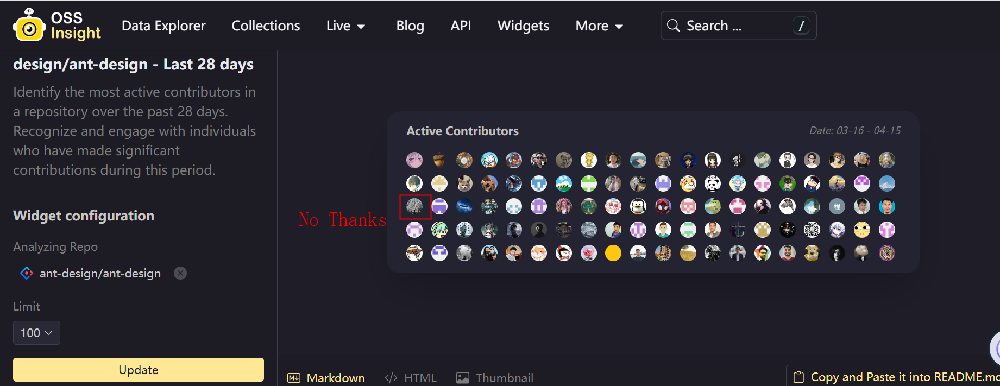
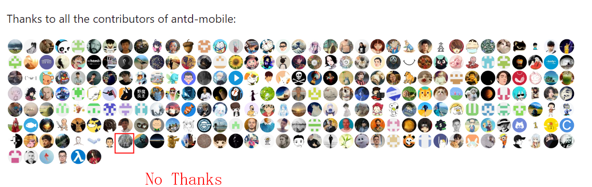

    

        
    

    

        
<strong>姓名：</strong>Meetacoo

        
<strong>邮箱：</strong>2283785225@qq.com

        
<strong>个人简介：</strong>敢想敢做敢拼，爱工作爱生活，爱Beauty。

    

# 关于个人

---

## 职业目标

做好前端开发工程师的工作，将我的技能和激情投入到有挑战性的项目中。

---

## 小小贡献

在ant-design和ant-design-mobile上有一点点的小贡献。

*新改的[2024.08.07]*

---

  
  

---

## 教育背景

- **本科:** 游戏开发是本命（文科生爆改工科女）

---

## 技能

- **过目不忘** （假的）

---

## 工作经验

- **19年中旬至今** 18年开始实习，19年正式入行

---

## 个人主页

- **Blog:** [CSDN](https://blog.csdn.net/Meetacoo)
- **Github:** [Github](https://github.com/Meetacoo)

---

## 兴趣爱好

- **吃** 爱好尝试各种美食，特别是喜欢尝试不同地区的特色小吃
- **喝** 最喜欢白开水了呢

[//]: # (- **读书** 闲暇时间喜欢阅读技术和小说类书籍，保持对知识的持续学习)

*以上介绍由AI生成
